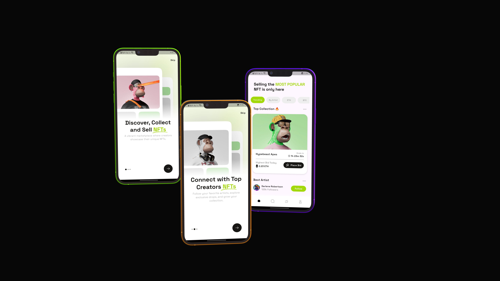

# 🎨 Artifya - NFT UI App  

An elegant **Flutter UI** concept for an NFT marketplace.  
Artifya showcases smooth, modern design screens for discovering, viewing, and bidding on NFTs.  
🚫 No backend – this app is focused entirely on **UI/UX** design.

  
  
  

---

## ✨ Features  

- **Onboarding** screens with illustrations and page indicators  
- **Home UI**: NFT collections, popular items, and featured artists  
- **Detail UI**: Bidding, timers, and NFT info  
- **Collection View**: Artist details and item gallery  
- **Dark Mode Ready**

---

## 🛠 Tech Stack  

| Layer           | Tool/Package          |
|-----------------|------------------------|
| UI Framework    | Flutter                |
| Routing         | `go_router`            |
| Fonts           | `google_fonts`         |
| UI Scaling      | `flutter_screenutil`   |
| Animations      | `smooth_page_indicator`|
| Vector Support  | `flutter_svg`          |
| Spacing         | `gap`                  |
| Icons           | `cupertino_icons`      |

---

## 📸 Screenshots  

| Onboarding | Home |
|------------|------|
|  |  |

---

## 🔗 Design Resources

  

